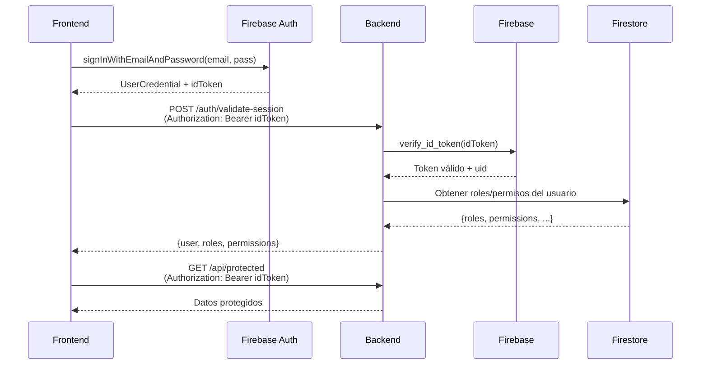

# ⚠️ ESTADO ACTUAL Y SOLUCIONES DISPONIBLES

## 📊 Diagnóstico Actual

### ✅ Lo que funciona:

- Backend autentica usuarios correctamente
- Endpoints protegidos rechazan peticiones sin token
- Sistema de roles y permisos operativo
- Código modificado para generar tokens (listo)

### ❌ Lo que NO funciona:

- Firebase Admin SDK no puede generar `custom_token`
- **Causa:** Falta configuración de credenciales de Service Account

### 🔍 Error específico:

```
Failed to determine service account: metadata.google.internal not found
```

---

## 🎯 SOLUCIONES DISPONIBLES

### Opción 1: ⚡ SOLUCIÓN RÁPIDA - Autenticación Directa en Frontend (RECOMENDADA)

**Sin necesidad de configurar credenciales del backend**

El frontend puede autenticar directamente con Firebase Auth SDK:

```typescript
// ✅ SOLUCIÓN INMEDIATA - Frontend
import { signInWithEmailAndPassword, getAuth } from "firebase/auth";

const auth = getAuth();

async function login(email: string, password: string) {
  // Autenticación directa con Firebase
  const userCredential = await signInWithEmailAndPassword(
    auth,
    email,
    password
  );

  // Obtener ID token
  const idToken = await userCredential.user.getIdToken();

  // Opcional: Validar con backend y obtener roles/permisos
  const response = await fetch("http://backend:8000/auth/validate-session", {
    method: "POST",
    headers: {
      Authorization: `Bearer ${idToken}`,
      "Content-Type": "application/json",
    },
  });

  const userData = await response.json();

  return {
    user: userData.user,
    idToken: idToken,
  };
}

// Usar idToken en todas las peticiones
fetch("http://backend:8000/api/protected", {
  headers: { Authorization: `Bearer ${idToken}` },
});
```

**Ventajas:**

- ✅ Funciona inmediatamente (no requiere cambios en backend)
- ✅ No necesita credenciales adicionales
- ✅ Más seguro (validación directa por Firebase)
- ✅ Tokens con renovación automática
- ✅ Soporte para múltiples proveedores (Google, etc.)

**Desventajas:**

- ⚠️ Credenciales de Firebase en el frontend (.env del frontend)
- ⚠️ Backend solo valida, no controla autenticación

---

### Opción 2: 🔧 Configurar Service Account (Backend completo)

**Para control total desde el backend**

#### Paso 1: Obtener Service Account Key

1. Ve a [Firebase Console](https://console.firebase.google.com/)
2. Selecciona proyecto: `unidad-cumplimiento-aa245`
3. Settings ⚙️ → Service accounts
4. Click "Generate new private key"
5. Descarga el archivo JSON

#### Paso 2: Configurar localmente

**Opción A - Usar el script de configuración:**

```bash
python setup_firebase_credentials.py
```

**Opción B - Manual:**

```bash
# Convertir JSON a base64
$json = Get-Content "path/to/serviceAccountKey.json" -Raw
$bytes = [System.Text.Encoding]::UTF8.GetBytes($json)
$base64 = [Convert]::ToBase64String($bytes)

# Crear/actualizar .env
echo "FIREBASE_SERVICE_ACCOUNT_KEY=$base64" >> .env
```

**Opción C - Application Default Credentials (solo desarrollo):**

```bash
gcloud auth application-default login
```

#### Paso 3: Reiniciar backend

Una vez configuradas las credenciales, el backend generará `custom_token` automáticamente.

**Ventajas:**

- ✅ Control total desde backend
- ✅ Backend genera tokens
- ✅ Más fácil auditar autenticación

**Desventajas:**

- ⚠️ Requiere configuración adicional
- ⚠️ Service Account Key debe protegerse
- ⚠️ Más complejo de mantener

---

## 🚀 RECOMENDACIÓN

### Para desarrollo inmediato → **Opción 1** (Frontend directo)

Más rápido, más seguro, y es el patrón recomendado por Firebase:

```typescript
// Frontend - login.ts
import { getAuth, signInWithEmailAndPassword } from "firebase/auth";

export async function login(email: string, password: string) {
  const auth = getAuth();
  const userCredential = await signInWithEmailAndPassword(
    auth,
    email,
    password
  );
  const idToken = await userCredential.user.getIdToken();

  // Obtener roles/permisos del backend
  const res = await fetch(`${API_URL}/auth/validate-session`, {
    headers: { Authorization: `Bearer ${idToken}` },
  });

  return await res.json();
}
```

### Para control backend completo → **Opción 2** (Service Account)

Solo si necesitas:

- Crear usuarios desde el backend
- Lógica de autenticación personalizada en backend
- Integración con sistemas legacy

---

## 📝 Flujo Recomendado (Opción 1)



**El backend ya tiene todo listo para este flujo:**

- ✅ `/auth/validate-session` valida tokens
- ✅ Sistema de roles y permisos funcional
- ✅ Middleware de autorización configurado

---

## 🔐 Seguridad

### Opción 1 (Recomendada):

- Frontend tiene config de Firebase (API Key pública - está bien)
- idToken enviado en cada petición
- Backend valida cada token con Firebase
- Service Account solo en backend (más seguro)

### Opción 2:

- Service Account Key debe estar en backend
- **NUNCA** exponer Service Account en frontend
- Usar variables de entorno

---

## ✅ Siguiente Paso Recomendado

### Implementar Opción 1 en el frontend:

1. **Instalar Firebase:**

```bash
npm install firebase
```

2. **Configurar Firebase (`lib/firebase.ts`):**

```typescript
import { initializeApp } from "firebase/app";
import { getAuth } from "firebase/auth";

const firebaseConfig = {
  apiKey: process.env.NEXT_PUBLIC_FIREBASE_API_KEY,
  authDomain: "unidad-cumplimiento-aa245.firebaseapp.com",
  projectId: "unidad-cumplimiento-aa245",
  // ... otros campos
};

const app = initializeApp(firebaseConfig);
export const auth = getAuth(app);
```

3. **Crear hook de autenticación (`hooks/useAuth.ts`):**

```typescript
import { useState, useEffect } from "react";
import { onAuthStateChanged } from "firebase/auth";
import { auth } from "@/lib/firebase";

export function useAuth() {
  const [user, setUser] = useState(null);
  const [idToken, setIdToken] = useState<string | null>(null);
  const [loading, setLoading] = useState(true);

  useEffect(() => {
    return onAuthStateChanged(auth, async (firebaseUser) => {
      if (firebaseUser) {
        const token = await firebaseUser.getIdToken();
        setUser(firebaseUser);
        setIdToken(token);
      } else {
        setUser(null);
        setIdToken(null);
      }
      setLoading(false);
    });
  }, []);

  return { user, idToken, loading };
}
```

4. **Crear servicio de autenticación (`services/auth.service.ts`):**

```typescript
import { signInWithEmailAndPassword, signOut } from "firebase/auth";
import { auth } from "@/lib/firebase";

const API_URL = process.env.NEXT_PUBLIC_API_URL;

export async function login(email: string, password: string) {
  // Login con Firebase
  const userCredential = await signInWithEmailAndPassword(
    auth,
    email,
    password
  );
  const idToken = await userCredential.user.getIdToken();

  // Obtener datos adicionales del backend
  const response = await fetch(`${API_URL}/auth/validate-session`, {
    method: "POST",
    headers: { Authorization: `Bearer ${idToken}` },
  });

  if (!response.ok) throw new Error("Validation failed");

  return await response.json();
}

export async function logout() {
  await signOut(auth);
}

export async function makeAuthRequest(url: string, options = {}) {
  const user = auth.currentUser;
  if (!user) throw new Error("Not authenticated");

  const token = await user.getIdToken();

  return fetch(url, {
    ...options,
    headers: {
      Authorization: `Bearer ${token}`,
      "Content-Type": "application/json",
      ...options.headers,
    },
  });
}
```

---

## 🆘 Soporte

Si decides usar **Opción 2**, ejecuta:

```bash
python setup_firebase_credentials.py
```

El script interactivo te guiará paso a paso.

---

**Estado:** ✅ Backend listo, falta decisión de flujo de autenticación
**Recomendación:** Opción 1 (Frontend directo con Firebase Auth)
**Tiempo estimado:** 30 minutos de implementación en frontend
