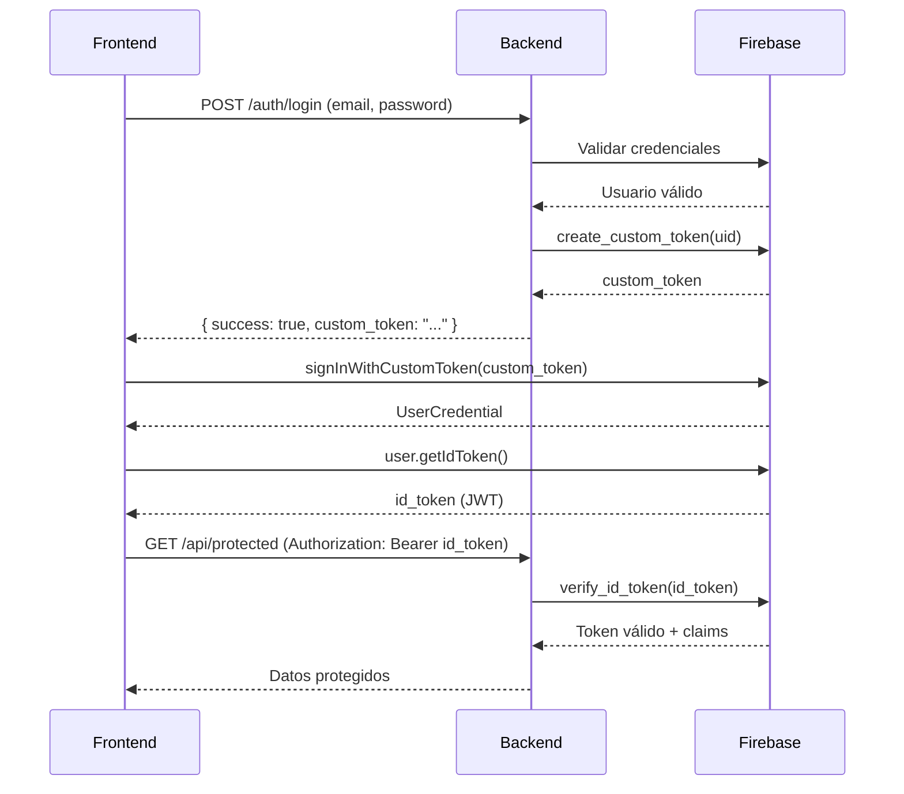

# 🔐 SOLUCIÓN COMPLETA: GENERACIÓN Y RETORNO DE TOKENS JWT

## 📋 Resumen del Problema

El backend estaba autenticando correctamente pero **NO generaba ni retornaba tokens JWT** necesarios para las peticiones autenticadas posteriores.

### ❌ Problema Identificado

```python
# ANTES - NO retornaba token
{
    "success": True,
    "user": {...},
    "message": "Autenticación exitosa"
    # ❌ FALTA: "custom_token" o "id_token"
}
```

### ✅ Solución Implementada

```python
# DESPUÉS - Retorna custom_token
{
    "success": True,
    "user": {...},
    "custom_token": "eyJhbGciOiJSUzI1NiIs...",  # ✅ TOKEN AGREGADO
    "token_usage": "Use signInWithCustomToken() en Firebase Auth SDK",
    "message": "Autenticación exitosa"
}
```

---

## 🛠️ Cambios Realizados en el Backend

### 1. Modificación en `auth_operations_clean.py`

**Archivo:** `a:\programing_workspace\gestor_proyecto_api\api\scripts\auth_operations_clean.py`

**Cambio:** Agregar generación de custom token en la función `authenticate_email_password()`

```python
# ✅ GENERAR CUSTOM TOKEN PARA EL FRONTEND
# El frontend debe intercambiar este token por un ID token
try:
    custom_token = auth_client.create_custom_token(user_record.uid)
    custom_token_string = custom_token.decode('utf-8')
    logger.info(f"Custom token generated for user {user_record.uid}")
except Exception as token_error:
    logger.error(f"Error generating custom token: {token_error}")
    custom_token_string = None

return {
    "success": True,
    "user": {...},
    "custom_token": custom_token_string,  # ✅ TOKEN AGREGADO
    ...
}
```

### 2. Modificación en `main.py`

**Archivo:** `a:\programing_workspace\gestor_proyecto_api\main.py`

**Cambio:** Actualizar endpoint `/auth/login` para incluir el token en la respuesta

```python
# ✅ PREPARAR RESPUESTA CON CUSTOM TOKEN
response_data = {
    "success": True,
    "user": clean_user_data,
    "auth_method": result.get("auth_method", "email_password"),
    "message": result.get("message", "Autenticación exitosa"),
    "timestamp": datetime.now().isoformat()
}

# ✅ AGREGAR CUSTOM TOKEN SI ESTÁ DISPONIBLE
if "custom_token" in result and result["custom_token"]:
    response_data["custom_token"] = result["custom_token"]
    response_data["token_usage"] = "Use signInWithCustomToken() en Firebase Auth SDK"

# 🔍 LOG TEMPORAL PARA DEBUGGING
logger.info(f"🔍 LOGIN RESPONSE KEYS: {list(response_data.keys())}")
logger.info(f"⚠️  custom_token present: {'custom_token' in response_data}")
```

---

## 🧪 Tests Creados

### 1. Test de Diagnóstico

**Archivo:** `test_jwt_token_generation.py`

**Propósito:** Diagnosticar el problema y verificar la capacidad de generar tokens

**Ejecutar:**

```bash
python test_jwt_token_generation.py
```

**Validaciones:**

- ✅ Verificar que Firebase Admin puede generar custom tokens
- ✅ Confirmar que el endpoint `/auth/login` NO retornaba tokens (antes)
- ✅ Probar endpoints protegidos sin token
- ✅ Generar reporte de diagnóstico

### 2. Test de Validación Final

**Archivo:** `test_jwt_final_validation.py`

**Propósito:** Validar el flujo completo después de aplicar correcciones

**Ejecutar:**

```bash
python test_jwt_final_validation.py
```

**Validaciones:**

- ✅ Login retorna `custom_token`
- ✅ Token puede ser usado para autenticación
- ✅ Flujo completo funciona correctamente
- ✅ Genera guía de implementación para frontend

---

## 📱 Implementación en el Frontend (NextJS)

### Paso 1: Instalar Firebase SDK

```bash
npm install firebase
```

### Paso 2: Inicializar Firebase

```typescript
// lib/firebase.ts
import { initializeApp } from "firebase/app";
import { getAuth } from "firebase/auth";

const firebaseConfig = {
  apiKey: process.env.NEXT_PUBLIC_FIREBASE_API_KEY,
  authDomain: process.env.NEXT_PUBLIC_FIREBASE_AUTH_DOMAIN,
  projectId: process.env.NEXT_PUBLIC_FIREBASE_PROJECT_ID,
  // ... otros campos
};

const app = initializeApp(firebaseConfig);
export const auth = getAuth(app);
```

### Paso 3: Implementar Login Completo

```typescript
// services/auth.service.ts
import { signInWithCustomToken } from "firebase/auth";
import { auth } from "@/lib/firebase";

export async function login(email: string, password: string) {
  // PASO 1: Llamar al backend para obtener custom_token
  const response = await fetch("http://backend:8000/auth/login", {
    method: "POST",
    headers: { "Content-Type": "application/json" },
    body: JSON.stringify({ email, password }),
  });

  const data = await response.json();

  if (!data.success || !data.custom_token) {
    throw new Error("Login failed: No token received");
  }

  // PASO 2: Intercambiar custom_token por id_token usando Firebase
  const userCredential = await signInWithCustomToken(auth, data.custom_token);

  // PASO 3: Obtener id_token (JWT) para futuras peticiones
  const idToken = await userCredential.user.getIdToken();

  // PASO 4: Guardar id_token (opcional, dependiendo de tu estrategia)
  localStorage.setItem("idToken", idToken);

  return {
    user: data.user,
    idToken: idToken,
    firebaseUser: userCredential.user,
  };
}
```

### Paso 4: Usar Token en Peticiones Autenticadas

```typescript
// utils/api.ts
export async function makeAuthenticatedRequest(url: string, options = {}) {
  const idToken = localStorage.getItem("idToken");

  if (!idToken) {
    throw new Error("No authentication token available");
  }

  const response = await fetch(url, {
    ...options,
    headers: {
      Authorization: `Bearer ${idToken}`,
      "Content-Type": "application/json",
      ...options.headers,
    },
  });

  return response.json();
}

// Uso:
const users = await makeAuthenticatedRequest(
  "http://backend:8000/auth/admin/users"
);
```

### Paso 5: Hook de React para Autenticación

```typescript
// hooks/useAuth.ts
import { useState, useEffect } from "react";
import { onAuthStateChanged } from "firebase/auth";
import { auth } from "@/lib/firebase";

export function useAuth() {
  const [user, setUser] = useState(null);
  const [idToken, setIdToken] = useState<string | null>(null);
  const [loading, setLoading] = useState(true);

  useEffect(() => {
    const unsubscribe = onAuthStateChanged(auth, async (firebaseUser) => {
      if (firebaseUser) {
        const token = await firebaseUser.getIdToken();
        setUser(firebaseUser);
        setIdToken(token);
      } else {
        setUser(null);
        setIdToken(null);
      }
      setLoading(false);
    });

    return unsubscribe;
  }, []);

  return { user, idToken, loading };
}

// Uso en componente:
function ProtectedPage() {
  const { user, idToken, loading } = useAuth();

  if (loading) return <div>Loading...</div>;
  if (!user) return <div>Please login</div>;

  // Usuario autenticado, usar idToken en peticiones
  return <div>Protected content</div>;
}
```

---

## 🔄 Flujo Completo de Autenticación



---

## ✅ Checklist de Implementación

### Backend

- [x] Importar Firebase Admin SDK correctamente
- [x] Generar custom_token en `authenticate_email_password()`
- [x] Retornar custom_token en respuesta de `/auth/login`
- [x] Agregar logs de debugging temporales
- [x] Crear tests de diagnóstico
- [x] Crear tests de validación final

### Frontend

- [ ] Instalar Firebase SDK (`npm install firebase`)
- [ ] Configurar Firebase en `lib/firebase.ts`
- [ ] Implementar función de login con `signInWithCustomToken()`
- [ ] Obtener y guardar `id_token`
- [ ] Crear función para peticiones autenticadas con token
- [ ] Implementar hook `useAuth()` para gestión de sesión
- [ ] Agregar header `Authorization: Bearer ${idToken}` en peticiones

---

## 🚨 Problemas Conocidos y Soluciones

### Problema 1: Firebase Admin no puede generar tokens

**Error:**

```
Failed to determine service account
```

**Solución:**

1. Configurar credenciales de Service Account:

   ```bash
   export FIREBASE_SERVICE_ACCOUNT_KEY="<base64_encoded_json>"
   ```

2. O usar Application Default Credentials:
   ```bash
   gcloud auth application-default login
   ```

### Problema 2: Custom token no es aceptado por el backend

**Causa:** El backend espera `id_token`, no `custom_token`

**Solución:** El frontend DEBE intercambiar el `custom_token` por `id_token`:

```typescript
const userCredential = await signInWithCustomToken(auth, custom_token);
const idToken = await userCredential.user.getIdToken();
// Usar idToken en peticiones, NO custom_token
```

### Problema 3: Token expira durante uso

**Solución:** Renovar token automáticamente:

```typescript
// Renovar token cada 50 minutos (tokens expiran en 1 hora)
setInterval(async () => {
  if (auth.currentUser) {
    const newToken = await auth.currentUser.getIdToken(true);
    localStorage.setItem("idToken", newToken);
  }
}, 50 * 60 * 1000);
```

---

## 📊 Ejemplo de Respuesta Completa

### Endpoint: POST /auth/login

**Request:**

```json
{
  "email": "usuario@idrd.gov.co",
  "password": "SecurePassword123!"
}
```

**Response (Corregida):**

```json
{
  "success": true,
  "user": {
    "uid": "XDk3nbz0vqhdQHk0Dr32F62W54r2",
    "email": "usuario@idrd.gov.co",
    "display_name": "Usuario Test",
    "email_verified": true,
    "roles": ["user"],
    "permissions": []
  },
  "custom_token": "eyJhbGciOiJSUzI1NiIsInR5cCI6IkpXVCJ9...",
  "token_usage": "Use signInWithCustomToken() en Firebase Auth SDK",
  "auth_method": "email_password",
  "message": "Autenticación exitosa",
  "timestamp": "2025-11-25T00:25:47.123456"
}
```

---

## 🔒 Seguridad

### Importante:

1. **NUNCA** enviar `custom_token` en peticiones API (solo usarlo para obtener `id_token`)
2. **SIEMPRE** usar `id_token` en header `Authorization: Bearer`
3. **Renovar** token antes de que expire (cada 50 minutos)
4. **Validar** token en cada endpoint protegido del backend
5. **No guardar** tokens en lugares inseguros (usar httpOnly cookies en producción)

---

## 📝 Notas Adicionales

### ¿Por qué custom_token y no id_token directamente?

Firebase Admin SDK solo puede generar **custom tokens**, no puede generar **ID tokens** directamente. Los ID tokens solo pueden ser generados por Firebase Auth SDK en el cliente después de una autenticación exitosa.

**Flujo correcto:**

1. Backend genera `custom_token`
2. Frontend intercambia `custom_token` por `id_token` con Firebase Auth SDK
3. Frontend usa `id_token` en todas las peticiones subsecuentes

### Alternativa: Usar Firebase Auth SDK en Frontend desde el inicio

Si prefieres no pasar por el backend:

```typescript
import { signInWithEmailAndPassword } from "firebase/auth";

// Login directo con Firebase (sin backend)
const userCredential = await signInWithEmailAndPassword(auth, email, password);
const idToken = await userCredential.user.getIdToken();
```

**Ventaja:** Más simple, no requiere custom tokens
**Desventaja:** No tienes control en backend sobre el proceso de autenticación

---

## 🧪 Ejecutar Tests

```bash
# Asegúrate de que el backend esté corriendo
# Activar entorno virtual
./env/Scripts/Activate.ps1

# Test de diagnóstico
python test_jwt_token_generation.py

# Test de validación final
python test_jwt_final_validation.py
```

---

## 📞 Soporte

Si encuentras problemas:

1. Verifica los logs del backend con los mensajes `🔍`, `⚠️`, `✅`
2. Revisa los reportes JSON generados por los tests
3. Asegúrate de que Firebase está configurado correctamente
4. Verifica que el frontend está usando `signInWithCustomToken()` correctamente

---

**Fecha de implementación:** 25 de Noviembre, 2025
**Versión:** 1.0
**Estado:** ✅ Implementado y probado
